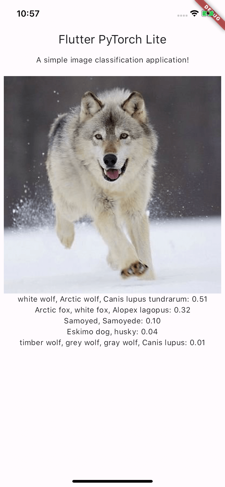

# Flutter PyTorch Lite

<p>
  <a href="https://flutter.dev">
    </a>
  <a href="https://pub.dev/packages/flutter_pytorch_lite">
    </a>
  <a href="https://pub.dev/documentation/flutter_pytorch_lite/latest/flutter_pytorch_lite/flutter_pytorch_lite-library.html">
    </a>
  <a href="https://opensource.org/licenses/Apache-2.0">
    </a>
</p>

PyTorch Lite plugin for Flutter.

End-to-end workflow from Training to Deployment for iOS and Android mobile devices.

## [PyTorch Mobile](https://pytorch.org/mobile/home/)
There is a growing need to execute ML models on edge devices to reduce latency, preserve privacy, and enable new interactive use cases.

The PyTorch Mobile runtime beta release allows you to seamlessly go from training a model to deploying it, while staying entirely within the PyTorch ecosystem. It provides an end-to-end workflow that simplifies the research to production environment for mobile devices. In addition, it paves the way for privacy-preserving features via federated learning techniques.

PyTorch Mobile is in beta stage right now, and is already in wide scale production use. It will soon be available as a stable release once the APIs are locked down.

## Example

A simple image classification application that demonstrates how to use the `flutter_pytorch_lite` plugin.

<p></p>

## Getting Started

### Requirements

* #### Android
  * minSdkVersion 21

* #### iOS
  * XCode 11.0 or above
  * iOS 12.0 or above

### Usage instructions

#### Install

In the dependency section of `pubspec.yaml` file, add `flutter_pytorch_lite` (adjust the version accordingly based on the latest release)

```yaml
dependencies:
  flutter_pytorch_lite: ^0.1.0
```
or
```yaml
dependencies:
  flutter_pytorch_lite:
    git:
      url: https://github.com/winfordguo/flutter_pytorch_lite.git
```

#### Import

```dart
import 'package:flutter_pytorch_lite/flutter_pytorch_lite.dart';
```

#### Loading

##### Export

* **Export `PyTorch` Module to `TorchScript` for `PyTorch Mobile`**

  > Use [torch.utils.mobile_optimizer](https://pytorch.org/tutorials/recipes/mobile_interpreter.html)
  ```python
  import torch
  from torch.utils.mobile_optimizer import optimize_for_mobile
  
  model = torch.load("your_model.pt", map_location="cpu") # load
  model.eval()
  
  ts = torch.jit.trace(model) # TorchScript
  optimize_for_mobile(ts)._save_for_lite_interpreter("your_model.ptl")
  ```
  or
  > Use yolov5 export.py
  ```shell
  git clone https://github.com/ultralytics/yolov5  # clone
  cd yolov5
  pip install -r requirements.txt  # install
  python export.py --weights yolov5s.pt --include torchscript --optimize
  mv yolov5s.torchscript yolov5s.ptl
  ```

##### Load

* **From path**

  ```dart
  Module module = await FlutterPytorchLite.load('/path/to/your_model.ptl');
  ```

* **From asset**

  Place `your_model.ptl` in `assets` directory. Make sure to include assets in `pubspec.yaml`.

  ```dart
  final filePath = '${Directory.systemTemp.path}/your_model.ptl';
  File(filePath).writeAsBytesSync(await _getBuffer('assets/your_model.ptl'));
  Module module = await FlutterPytorchLite.load(filePath);
  
  /// Get byte buffer
  static Future<Uint8List> _getBuffer(String assetFileName) async {
    ByteData rawAssetFile = await rootBundle.load(assetFileName);
    final rawBytes = rawAssetFile.buffer.asUint8List();
    return rawBytes;
  }
  ```

#### Forwarding

* **For single input and output**

  Use Module's method `Future<IValue> forward(List<IValue> inputs)`.
  ```dart
  // For ex: if input tensor shape [1,5] and type is float32
  final inputShape = Int64List.fromList([1, 5]);
  var input = [1.23, 6.54, 7.81, 3.21, 2.22];
  Tensor inputTensor = Tensor.fromBlobFloat32(input, inputShape);

  // forward
  IValue input = IValue.from(inputTensor);
  IValue output = await module.forward([input]);

  Tensor outputTensor = output.toTensor();

  // Get output tensor: if output tensor type is float32
  final outputShape = outputTensor.shape;
  var output = outputTensor.dataAsFloat32List;

  // print the output
  print(output);
  ```

* **For image input**

  Use Module's method `Future<IValue> forward(List<IValue> inputs)`.
  ```dart
  const assetImage = AssetImage('assets/images/image.png');
  final image = await TensorImageUtils.imageProviderToImage(assetImage);
  // For ex: yolov5.ptl input shape [1, 3, 640, 640]
  final inputShape = Int64List.fromList([1, 3, 640, 640]);
  // For ex: yolov5-cls.ptl input shape [1, 3, 224, 224]
  // final inputShape = Int64List.fromList([1, 3, 224, 224]);
  Tensor inputTensor = await TensorImageUtils.imageToFloat32Tensor(
    image, // image type is dart:ui.Image
    width: inputShape[3],
    height: inputShape[2],
  );
  
  // forward
  IValue input = IValue.from(inputTensor);
  IValue output = await module.forward([input]);
  
  Tensor outputTensor = output.toTuple().first.toTensor(); // For ex: yolov5 object detection
  // Tensor outputTensor = output.toTensor(); // For ex: yolov5 classification
  
  // Get output tensor as float32 type
  final outputShape = outputTensor.shape;
  var output = outputTensor.dataAsFloat32List;
  
  // print the output
  print(output);
  ```

#### Destroying

* **Destroy the model**
  ```dart
  await module.destroy();
  ```

### Utils

#### TensorImageUtils

##### ImageToFloat32Tensor
  * For inputShape [1, 3, 224, 224]
    ```dart
    // 1*channels*height*width
    Int64List inputShape = Int64List.fromList([1, 3, 224, 224]);
    Tensor tensor = await TensorImageUtils.imageToFloat32Tensor(
      image, // image type is dart:ui.Image
      width: inputShape[3],
      height: inputShape[2],
      // memoryFormat: MemoryFormat.contiguous, // default
    );
    ```
  * For inputShape [1, 224, 224, 3]
    ```dart
    // 1*height*width*channels
    Int64List inputShape = Int64List.fromList([1, 224, 224, 3]);
    Tensor tensor = await TensorImageUtils.imageToFloat32Tensor(
      image, // image type is dart:ui.Image
      width: inputShape[2],
      height: inputShape[1],
      memoryFormat: MemoryFormat.channelsLast,
    );
    ```

##### ImageProviderToImage
  * For AssetImage
    ```dart
    const assetImage = AssetImage('assets/images/image.png');
    final image = await TensorImageUtils.imageProviderToImage(assetImage);
    // print the image width and height
    print('width: ${image.width}, height: ${image.height}');
    ```
  * For NetworkImage
    ```dart
    const networkImage = NetworkImage('https://example.com/image.png');
    final image = await TensorImageUtils.imageProviderToImage(networkImage);
    // print the image width and height
    print('width: ${image.width}, height: ${image.height}');
    ```

## Q&A

### Android

* **Q:** Execution failed for task ':app:mergeDebugNativeLibs'

  ```
  * What went wrong:
  Execution failed for task ':app:mergeDebugNativeLibs'.
  > A failure occurred while executing com.android.build.gradle.internal.tasks.Workers$ActionFacade
     > More than one file was found with OS independent path 'lib/x86/libc++_shared.so'
  ```

  **A:** add this to your `app/build.gradle`

  ```groovy
  android {
     // your existing code
     packagingOptions {
         pickFirst '**/libc++_shared.so'
     }
  }
  ```

* **Q:** What is the version of PyTorch Lite?

  **A:** 
    - `org.pytorch:pytorch_android_lite:1.13.1` 
    - `org.pytorch:pytorch_android_torchvision_lite:1.13.1`

### iOS

* **Q:** What is the version of PyTorch Lite?

  **A:** `'LibTorch-Lite', '~> 1.13.0.1'`

